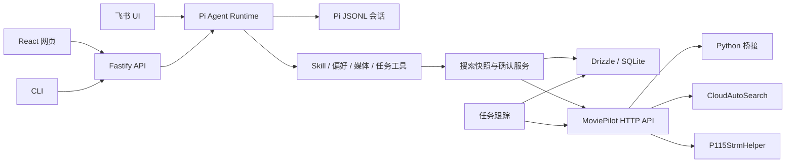
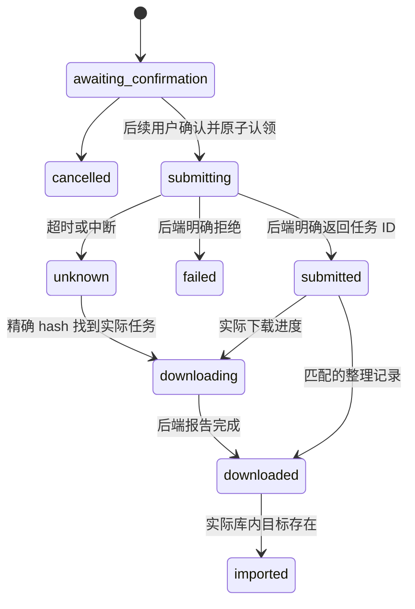

# 架构与状态规则

## 主体

服务在进程内嵌入 Pi coding-agent SDK，复用模型调用、function call 循环、持久 SessionManager、Skill 发现和上下文压缩。关闭通用 Bash、文件写入和动态扩展，工具集合由应用明确注册。

输入身份由已认证 UI 决定，模型不选择 userId。网页访问令牌映射为配置的个人 owner；飞书 open_id 白名单也映射到这个 owner。第一版是单人工作区，不以此映射冒充多人隔离权限。

## 三种持久状态

- Pi JSONL 保存模型上下文；同一 userId/conversationId 恢复同一个 Pi 文件。
- SQLite 保存显示消息、UI 绑定和明确的结构化长期偏好。
- SQLite 另存资源快照、确认提案及外部任务 ID/BTIH，作为业务事实。

每个会话 FIFO 排队，所有工具顺序执行；不同会话独立运行。最多缓存 50 个已打开 Pi 会话，空闲会话可以释放再从磁盘恢复。UI 操作也同步进 Pi 上下文；首次从网页按钮转入文字交互时会导入此前 UI 事实记录。

SQLite 使用 WAL 和版本化迁移。数据目录由 proper-lockfile 独占，避免 CLI、旧进程或第二实例同时写入。重启把仍在执行的请求标为中断，仍在提交的任务标为 unknown。

## 搜索与确认

`search_media` 保存本会话的媒体候选。`search_resources` 保存全部资源，以 UUID 标识快照与每个资源。先应用全部硬条件，再排序和分页。接口不存在 title/name、hash/id 等字段猜测；MP 的实际响应在适配器边界由 Zod 验证，然后进入严格的内部类型。

筛选接口替换完整条件，可保留或删除原有字段。更新筛选、季号、媒体或资源搜索会取消旧资源提案。确认绑定稳定 ID 和当前快照，不绑定“第几个结果”。

写操作必须先预览，15 分钟内由后续用户消息或按钮批准。模型同一轮调用 prepare 和 confirm 会被服务拒绝。UI 按钮包含 taskId 与随机 token，服务再核对 owner、conversationId 和快照。

`claimTask` 以 SQLite 条件更新原子认领一次。外部写请求不自动重试；HTTP 401 仅在 MP 明确未通过认证时刷新登录再请求。HTTP 5xx、网络断开和缺失确认内容都属于结果不确定。

## 下载证据

MP 使用下载 hash 查询下载器完整任务列表。整理记录必须同时匹配 hash、媒体来源/ID和提交时间。缺少完成证据时保持原状态，不从“正在下载列表”缺席推断完成。

115 在提交前解析所有 BTIH，保存明确的磁力链接。全批 BTIH 均报告完成才算 downloaded；部分失败会明确提示其他链接可能仍在执行。插件 manual_status 只有批次 ID 匹配时才可作为提交失败证据。

入库检查保留季和集数。本来已存在的内容不归功于新下载；MP 可用同一 hash 的新整理记录补充证据。115 链接提案没有媒体身份，只能确认离线下载完成；不能凭种子名称猜测已入库。115 资源提案保留媒体身份，可以在原本缺失的目标入库后更新 imported。

## 生命周期与故障

停止时先停止接收 UI 输入，再取消跟踪和模型请求，等待会话队列及 UI 投递完成，最后关闭数据库。飞书投递失败记录错误但不丢弃已持久的核心回复。

重复请求重放保存的 reply，不再次执行模型。中断请求不会自动重放。unknown 只核对已有精确 hash，未取得 hash 的 MP 私有 torrent 提交需要在后端人工核对。

API 只接受 Bearer 令牌，不从 URL 接收认证。数据、凭据、原始站点 Cookie 和下载上下文不返回给公共 UI/模型；公共资源摘要明确挑选字段。SQL 由 Drizzle 执行，外部响应只在集成边界验证。

## 维护约定

边界校验一次、内部保持类型明确。错误应有明确语义，不吞掉错误后假装成功。分支展开，函数命名说明其动作，模块按责任划分。网络代理、npm 镜像和模型端点使用部署者配置。

不自动迁移旧机器人模型历史。新服务拥有自己的稳定会话；旧机器人的多份混乱上下文不作为新服务的权威输入。现有媒体库、订阅和下载器配置由 MP 保持。
